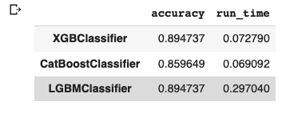

This assignments contains the following:
1. XGBoost, Catboost, LightGBM, randomforest, adaboost, decision tree classifier
2. Gradient boost regression techniques XGBoost, Catboost, LightGBM
3. showcase gradient boost ranking techniques XGBoost, Catboost, LightGBM

The ranking of boosting methods is as shown below

Link to the datasets: https://drive.google.com/drive/folders/1miq_qELggjjEKF85sXR0KsMTucGzykp0?usp=sharing

Link to the colab: https://colab.research.google.com/drive/1_eSUZOioJP9tLdjy4xM2dnMl3WGmAL7e?usp=sharing

Link to the video recording: https://drive.google.com/file/d/1NHSZvcsfIZOPqBJqbng2nGz2Utz_Cn5T/view?usp=sharing
